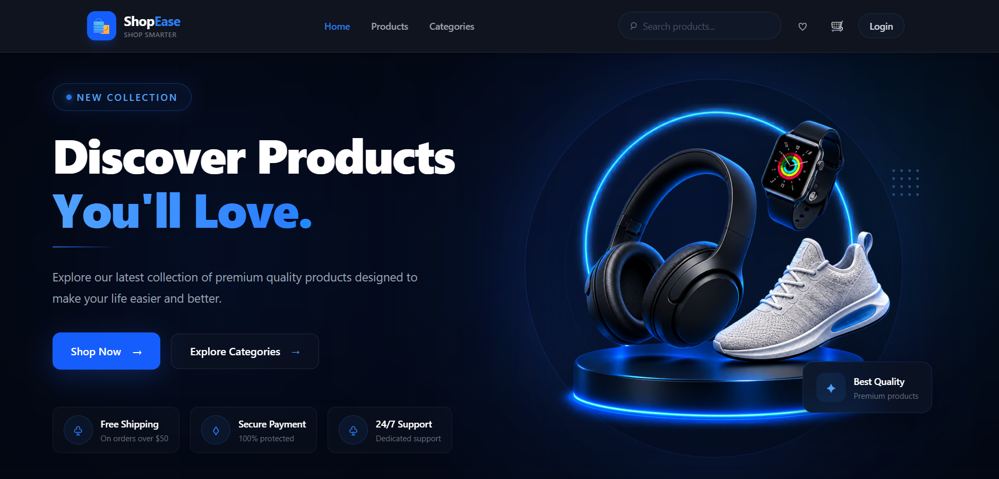
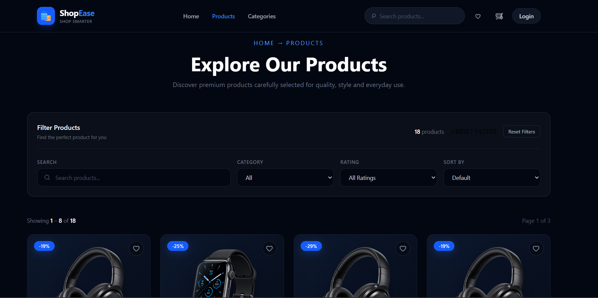
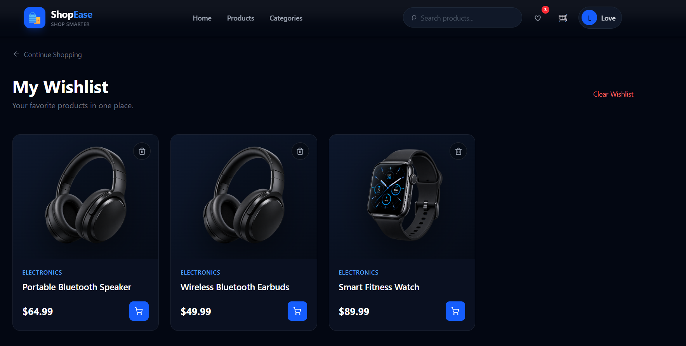
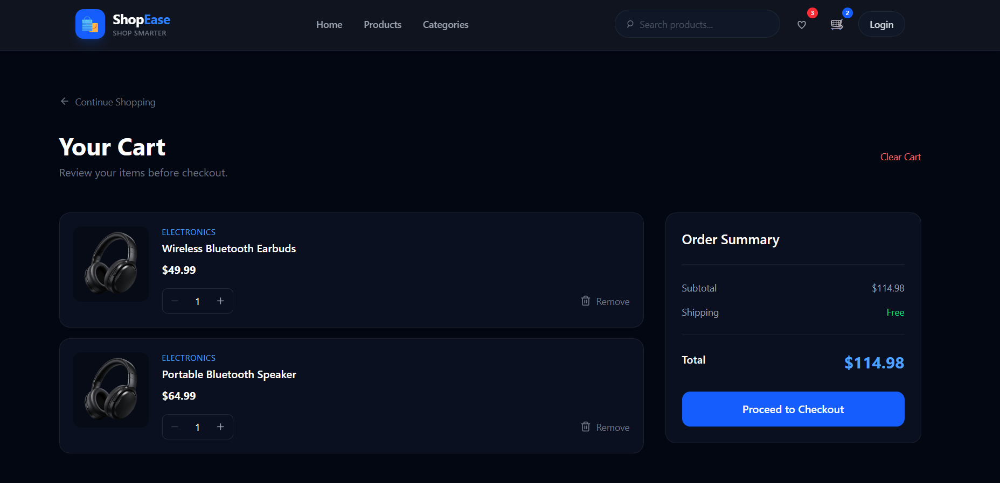

# 🛍️ ShopEase

### Modern E-Commerce Website built with React.js

[](https://react.dev/)
[](https://vite.dev/)
[](https://developer.mozilla.org/en-US/docs/Web/JavaScript)
[](https://reactrouter.com/)
[](https://react.dev/learn/passing-data-deeply-with-context)

---

## 📖 About

**ShopEase** is a responsive e-commerce website built with **React.js**.

It provides a complete shopping experience with product browsing, search, filtering, sorting, wishlist, cart management, and checkout functionality.

This project was created to practice and demonstrate modern **React.js and frontend development** concepts.

---

## ✨ Features

* 🏠 Responsive Home Page
* 🛍️ Product Listing
* 🔎 Product Search
* 🗂️ Category Filtering
* 💰 Price Filtering
* ↕️ Product Sorting
* 📄 Pagination
* ❤️ Wishlist
* 🛒 Shopping Cart
* ➕ Quantity Management
* 🗑️ Remove Items
* 💳 Checkout
* 🧩 Reusable Components
* 🔄 Context API State Management
* 🧭 React Router Navigation

---

## 🛠️ Tech Stack

* **React.js**
* **JavaScript (ES6+)**
* **React Router DOM**
* **Context API**
* **Vite**
* **CSS3**
* **Lucide React**

---

## 📸 Screenshots

### 🏠 Home



### 🛍️ Products



### ❤️ Wishlist



### 🛒 Cart



### 💳 Checkout


---

## 🚀 Getting Started

### Clone the repository

```bash
git clone https://github.com/YOUR-USERNAME/shopease-react-ecommerce.git
```

### Install dependencies

```bash
cd shopease-react-ecommerce
npm install
```

### Start the development server

```bash
npm run dev
```

Open the local URL shown in your terminal.

---

## 📁 Project Structure

```text
src/
├── components/
├── context/
├── data/
├── pages/
├── App.jsx
└── main.jsx
```

---

## 🔮 Future Improvements

* 🔐 User Authentication
* 🗄️ Backend & Database
* 💳 Payment Gateway
* 📦 Order Management
* ⭐ Product Reviews
* 🧑‍💼 Admin Dashboard
* 🤖 AI Product Recommendations

---

## 👨‍💻 Author

**Love Pehlaj**

BBIT Student | Frontend Developer | React.js Developer

---

⭐ If you like this project, consider giving it a **star**!

**Built with ❤️ using React.js**
